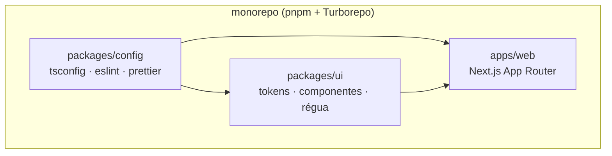

Este site começou como uma pasta vazia e uma lista de vontades: um portfólio que provasse trabalho, um blog pra escrever sobre o que estudo, e um requisito inegociável — **não parecer feito por template**.

## A arquitetura

Um monorepo enxuto. Não por moda: a justificativa é que o design system merece existir como pacote próprio, separado do app que o consome.



O `packages/config` centraliza as regras (TypeScript estrito, lint que trata `any` como erro); o `packages/ui` é a identidade visual inteira em forma de código; o `apps/web` é o site que você está lendo.

## Conteúdo com contrato

Todo post, projeto e estudo passa por um schema no build. Frontmatter errado não vira página quebrada — vira build vermelho:

```ts title="velite.config.ts"
const caseStudies = defineCollection({
  name: "CaseStudy",
  pattern: "case-studies/**/*.mdx",
  schema: s.object({
    title: s.string().max(120),
    date: s.isodate(),
    projectSlug: s.string().optional(),
  }),
});
```

O `projectSlug` opcional codifica uma decisão de modelagem: um estudo *pode* apontar pra um trabalho, mas não precisa — nem toda história que vale contar tem um repositório atrás.

## O que ficou de fora

Tanto quanto o que entrou: nada de CMS, nada de banco, nada de Kubernetes — por enquanto. O site nasceu no caminho mais simples que funciona, e a infraestrutura sofisticada virou uma trilha de aprendizado separada, que vai render os próximos estudos daqui.
