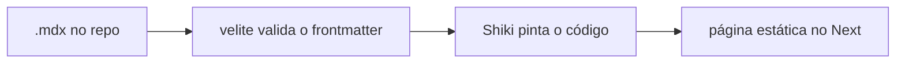

Este é o primeiro post daqui — e nada mais justo que ele seja sobre a máquina que o renderiza.

Eu queria três coisas do blog: escrever em Markdown sem burocracia, código destacado que fosse bonito de verdade (não um tema copiado do GitHub), e diagramas direto no texto. O caminho ficou assim:



## Frontmatter com contrato

Cada post passa por um schema antes do build. Se eu esquecer o título ou errar a data, **o build quebra** — o erro aparece na minha cara, não na de quem lê:

```ts title="velite.config.ts" showLineNumbers
const posts = defineCollection({
  name: "Post",
  pattern: "posts/**/*.mdx",
  schema: s.object({
    title: s.string().max(120),
    date: s.isodate(),
    summary: s.string().max(300),
    tags: s.array(s.string()).default([]),
  }),
});
```

Isso é o mesmo princípio de tipagem estrita do resto do código, aplicado a conteúdo: errar alto, não em silêncio.

## Código com a cara da casa

O destaque de sintaxe usa o Shiki (o mesmo motor do VS Code), mas com dois temas que eu derivei da paleta do site — âmbar para keywords, um azul frio para tipos, verde-oliva para strings. Troca junto com o dark mode.

## Diagramas como texto

O bloco lá em cima é um fence ` ```mermaid ` comum. Um plugin remark de dez linhas intercepta o bloco antes do highlighter e o transforma num componente React que renderiza o SVG no cliente — já com as cores do tema ativo.

O código completo está no [repositório](https://github.com/GabrielBeloDev/portifolio_gabriel).
