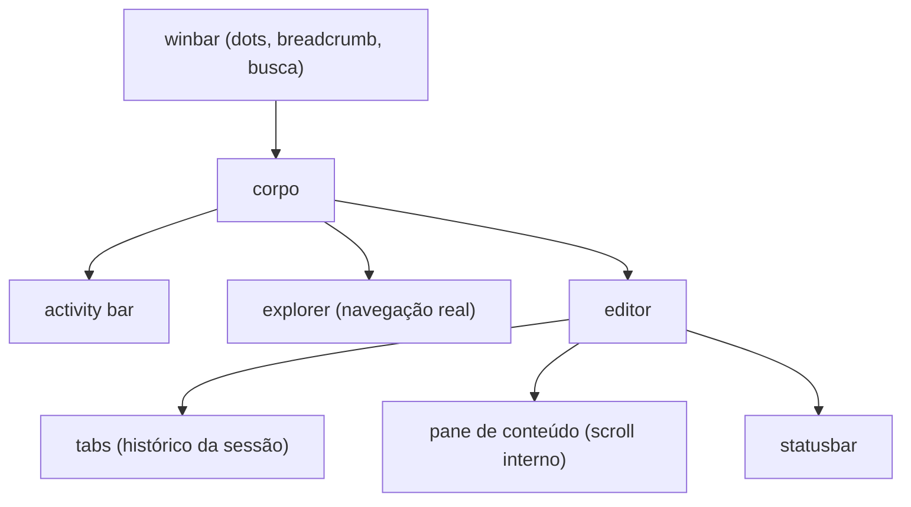

A primeira versão deste site era um caderno de engenharia. Fundo creme, uma régua de números de linha na lateral, tipografia sóbria. No papel fazia sentido. Na tela, eu abria a home e sentia que estava olhando pra um template que qualquer pessoa poderia ter. Hierarquia fraca, destaque âmbar que sumia no fundo claro, texto solto. Eu tinha aprovado aquilo, e mesmo assim não conseguia gostar.

Então joguei fora. Não os componentes, nem o conteúdo, nem a infraestrutura. Joguei fora a ideia. A pergunta que destravou tudo foi simples. Onde é que texto sobre código fica bonito de verdade? No editor. Eu passo o dia inteiro dentro de um, e nunca acho ele feio. O site virou isso.

## O site é a janela, não a página

A metáfora não é um enfeite no topo da página. O site inteiro roda dentro de um shell persistente que imita a janela de um editor.

O explorer não é decoração. Ele lista os arquivos de verdade do site, e os posts aparecem como `.mdx` porque eles são `.mdx` no repositório. As tabs também não fingem. Cada rota que você visita abre uma tab nova, o × fecha de verdade e te devolve pra vizinha, igual a um editor de verdade. Essa foi a regra que salvou o projeto do vale da esquisitice. Tudo que parece interativo precisa funcionar. No primeiro rascunho os ícones da barra lateral eram desenho, o chevron do explorer não colapsava nada, e a sensação era de cenário de filme. Cenário derruba a metáfora mais rápido que qualquer bug.

## Cores com cargo definido

Em vez de uma paleta bonita, cada cor ganhou um emprego. O âmbar marca ação e estado, o verde marca o que está vivo, o azul é sempre link, o vermelho é sempre problema. Parece óbvio escrito assim, mas foi isso que consertou a hierarquia da primeira versão, onde o âmbar tentava ser tudo ao mesmo tempo e acabava não sendo nada.

O dark é o tema nativo e o claro é derivado dele, porque um editor nasce escuro. E cada par de cor passou por auditoria de contraste antes de entrar. A cor mais apagada da paleta só pode aparecer em decoração, nunca em texto que carrega informação.

## Testes como contrato, não como enfeite

A parte que mais me orgulha não aparece na tela. Todo o comportamento do site está coberto por testes de ponta a ponta que rodam contra o banco real, e os seletores desses testes viraram um contrato. O botão de curtir se chama curtir post, o campo do editor se chama corpo em MDX, e nenhum redesign pode mudar esses nomes sem o teste gritar. Refiz o visual do site inteiro várias vezes nas últimas semanas e os fluxos de login, comentário e edição nunca quebraram em silêncio.

## Os bugs que quase me enganaram

Três achados do caminho merecem registro.

O primeiro parecia teste instável. Um spec de comentários falhava de vez em quando, sempre no cadastro. A causa real era um rate limit escondido na biblioteca de autenticação, que aceita três cadastros a cada dez segundos por IP.[^1] A suíte crescia, o quarto cadastro estourava o balde e derrubava um teste que não tinha nada a ver. Flakiness quase nunca é aleatória, ela só ainda não foi explicada.

[^1]: O balde é por IP e vale pra suíte inteira, então o quarto cadastro dentro da janela leva 429 mesmo vindo de outro spec. A cura foi espaçar os cadastros nos testes novos.

O segundo foi na navegação. Chamar `router.push` e `router.refresh` em sequência no Next 16 trava a transição, porque o refresh aborta o fetch da própria navegação que ele deveria completar. O botão ficava eternamente em estado de carregando.

O terceiro era de design mesmo. A statusbar âmbar sólida no rodapé, fiel ao mock que eu tinha desenhado, gritava tanto que atrapalhava a leitura dos posts. Ser fiel ao mock não é desculpa pra ser infiel ao leitor. Ela hoje é escura e discreta, e o âmbar ficou só nos detalhes.

## O que vem

O editor de posts que roda dentro do site (um editor dentro do editor, sim) está ganhando um assistente e ditado por voz. A ideia é escrever falando e deixar a máquina cuidar da transcrição. Quando estiver no ar, vira post também.

Se você quiser ver o código de tudo isso, o repositório é aberto e está linkado ali embaixo na statusbar, no ⑂ main.
