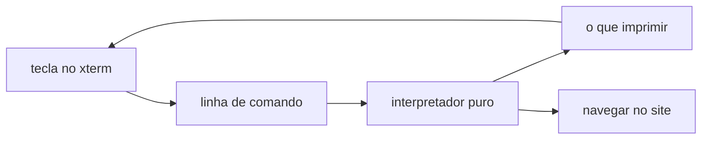

Meu site já parece um editor de código, com explorer, abas e barra de status. Faltava a peça mais óbvia de todas. Um terminal. Agora tem um no rodapé, e dá pra andar pelo site digitando `ls`, `cd blog` e `cat` como se os posts fossem arquivos. Abre com Ctrl e crase, o mesmo atalho do VS Code.

## A biblioteca certa pro trabalho

Pra desenhar o terminal usei o xterm.js, que é literalmente o mesmo emulador que roda dentro do VS Code. Fazia todo sentido, já que a metáfora do site é essa. Ele cuida do cursor, do scroll e das cores. O que ele não faz, e nem deveria, é entender os meus comandos. Isso é comigo.

## Separar o cérebro da tela

A decisão que segurou tudo em pé foi não misturar as duas coisas. De um lado fica o interpretador, que é código puro sem nenhuma tela por perto. Ele recebe uma linha de texto e o diretório atual, e devolve o que imprimir, pra onde navegar e se mudou de pasta. Do outro lado fica o xterm, que só desenha o resultado.

Essa separação tem um efeito prático ótimo. O interpretador dá pra testar sem abrir um navegador, então escrevi dezenas de casos cobrindo cada comando e cada erro. E se um dia eu quiser trocar o xterm por outra coisa, o cérebro do terminal continua o mesmo.

## O sistema de arquivos que não existe

Não há disco nenhum atrás disso. A árvore que o `ls` percorre é montada a partir das rotas do site, dos meus dotfiles e da lista de posts publicados. Quando você faz `cat` num post, o terminal imprime o frontmatter e o resumo. Quando faz `open`, ele navega o site de verdade.

## Fechado por dentro

Um terminal aberto na internet dá um frio na barriga justo. Por isso ele é restrito de propósito. Só existe um punhado de comandos, e qualquer outra coisa responde `command not found`. Não há `eval`, não há rede, não há acesso a arquivo de verdade. E a tentativa clássica de escapar pra fora com `cd ../../..` simplesmente para na raiz, porque isso é impossível por construção e não por um filtro que eu poderia esquecer de aplicar.

O resultado é pequeno e meio brincadeira, mas honesto. É um terminal que faz de conta que o site é um sistema de arquivos, e faz isso levando a sério a única coisa que importa num terminal público, que é não deixar ninguém sair do quintal.
